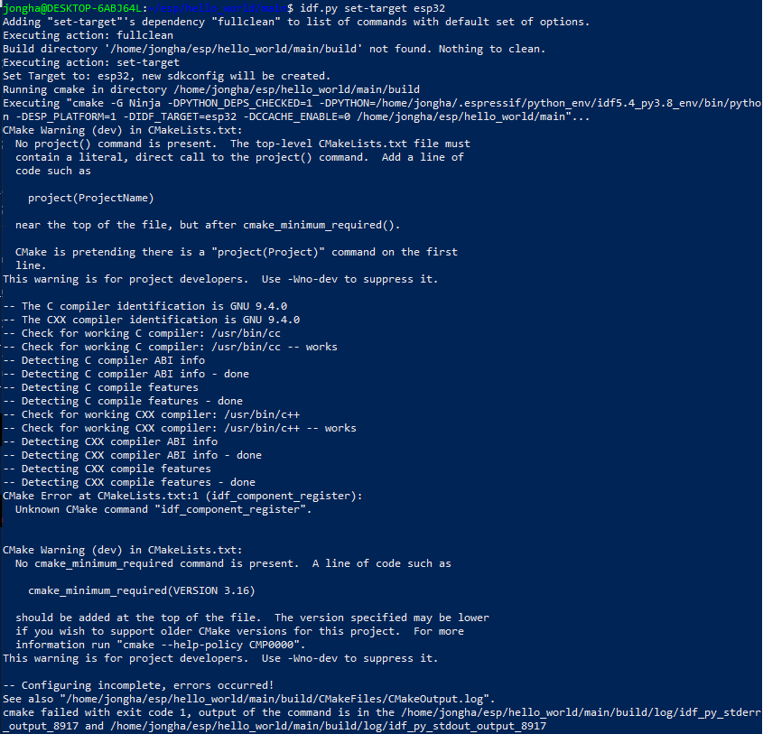
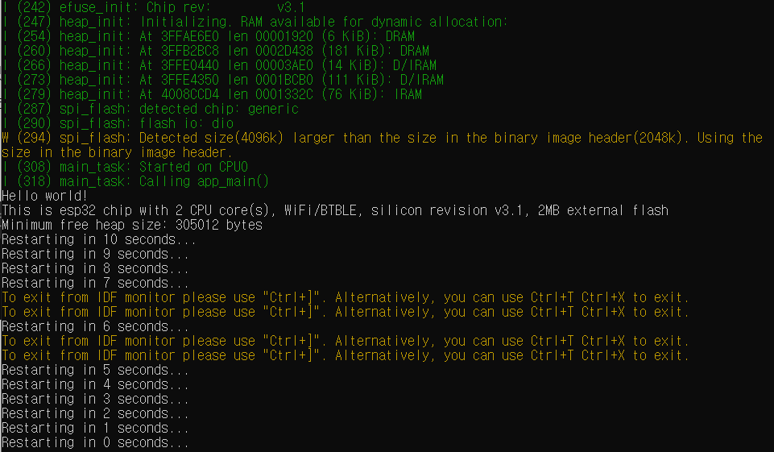

# 기본 세팅

### 목적 : esp32 를 wsl에서 esp-idf 를 이용해 펌웨어 개발하기 위한 기초 세팅

### idfx :

- 버전 :
    - Ubuntu 20.04, 22.04 사용
    - Python 3 이상(3.8, 3.10 사용)
    - pip3 24.2 이상(윈도우, wsl 모두)

- 지원되는 버전 :
    - ESP-IDF 4.0 이상
    - ESP8266_SDK 3.0 이상

- 설치 :
    - WSL 내부에서 다음 명령을 실행
    
    ```bash
    curl https://git.io/JyBgj --create-dirs -L -o $HOME/bin/idfx && chmod u+x $HOME/bin/idfx
    ```
    

- USB 연결 :
    - 다음 명령어로 패키지 설치
    
    ```bash
    sudo apt-get install git wget flex bison gperf python3 python3-pip python3-venv cmake ninja-build ccache libffi-dev libssl-dev dfu-util libusb-1.0-0
    ```
    
    - `python —version` 파이썬 버전 확인
    - `python3 --version` 파이썬3 버전 확인
    - 다음 명령어 실행하여 esp-idf 다운
    
    ```bash
    mkdir -p ~/esp
    cd ~/esp
    git clone --recursive https://github.com/espressif/esp-idf.git
    ```
    
    - ESP-IDF에서 사용하는 도구 설치
        - ESP32 용 도구
        
        ```bash
        cd ~/esp/esp-idf
        ./install.sh esp32
        ```
        
        - 더 많은 칩에 대한 도구 설치
        
        ```bash
        cd ~/esp/esp-idf
        ./install.sh esp32,esp32s2
        ```
        
        - 모든 대상에 대한 도구 설치
        
        ```bash
        cd ~/esp/esp-idf
        ./install.sh all
        ```
        
    - 도구 설치 경로 사용자 지정
    
    ```bash
    export IDF_TOOLS_PATH="$HOME/required_idf_tools_path"
    ./install.sh
    
    . ./export.sh
    ```
    
    - 환경 변수 설정(./.bashrc 최하단에 저장)
    
    ```bash
    alias get_idf='. $HOME/esp/esp-idf/export.sh'
    ```
    
    - 프로젝트 테스트(Hello World)
    
    ```bash
    cd ~/esp
    cp -r $IDF_PATH/examples/get-started/hello_world .
    ```
    
    - 프로젝트 구성(별다른 설정은 없음, USB 포트 속도에 따라 변경이 필요할 수 있음)
    
    ```bash
    cd ~/esp/hello_world
    idf.py set-target esp32
    idf.py menuconfig
    ```
    
    - `idf.py build` 를 실행하여 프로젝트 구축
    - `idf.py -p PORT flash` 를 실행
        - `PORT` 를 ESP32보드의 USB 포트 이름으로 변경
        - WSL의 경우 USB에 대한 권한이 필요하므로 다음을 따라가고 리눅스에서 진행 중인 경우 넘어갈 것.
        - PowerShell 을 관리자 권한으로 실행
        - 다음 명령을 실행하여 리눅스 기본 패키지 설치
        
        ```bash
        sudo apt update
        sudo apt install linux-tools-common
        ```
        
        - `usbipd list` 로 연결된 usb 포트 확인
        
        
        
        - `usbipd bind --busid 4-4` 로 원하는 포트를 공유
        - `usbipd attach --wsl --busid <busid>` 로 USB 디바이스 연결
        
        
        
        - WSL 에서 `lsusb` 로 연결되었는지 확인
        - WSL에서 디바이스 사용을 완료한 후 USB 디바이스의 연결을 끊는 법
        
        ```bash
        usbipd detach --busid <busid>
        ```
        
    - `idf.py set_target esp32` 실행
    
    
    
    - `idf.py menuconfig` 실행
    
    
    
    - python 버전 확인 (`python3 —version`, `pip3 --version` 은 최신 버전이어야 함.)
    - `python -m pip install esptool` 설치
    
    
    
    - `idfx flash PORT` (PORT는 해당 USB PORT로 변경, 여기서는 COM6)
    - 만약 버전이 맞는데도 에러가 난다면 Window의 pip 버전이 맞지 않는 것이므로 PowerShell에서 pip 업그레이드하고 이어서 진행
    
    
    
    - `idfx all PORT` (PORT는 해당 USB로 변경)
    
    
    
    - 쭉 진행되다 보면 Hello World 가 뜨는 것을 확인 가능
    
    
    
    - 중간에 에러가 있다면 아래 참고자료를 보고 따라할 것.

- 참고 자료 :
    
    [ESP-IDF](https://docs.espressif.com/projects/esp-idf/en/latest/esp32/get-started/linux-macos-setup.html "ESP-IDF")
    
    [WSL-USB권한 부여](https://learn.microsoft.com/ko-kr/windows/wsl/connect-usb "WSL-USB 권한")